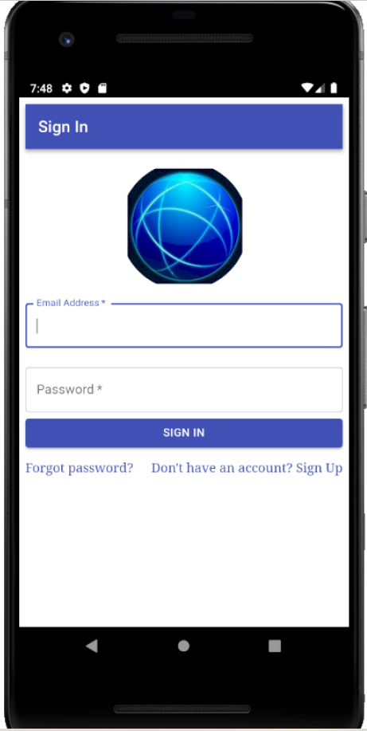

<h1>Progressive web application</h1>
When you first enter the page, you going to see sing in / sign up form. I used Firebase OAuth for authentication. 
The main function of the applications is to save orders along with all the necessary information and the ability to give them assign one of the following three statuses: ”Ordered”, ”Package arrived at address”, ”Received”.

<h2>Screenshots</h2>

 <h2>Technologies</h2>
 
- Node.js
- Java Script
- Firebase (Cloud Firestore)
- React.js
- React Router Library (to navigate between views and provide each of them with a separate link)
- React Lazyload (to increase the application loading speed)
- Development environment - Webstorm JetBrains
- Material UI
- Service Worker (Caching)
- IndexDB (to save data in the browser and to update automatically)

 <h2>Setup/Installation</h2>
 <h4> Webbrowser </h4>
 
 - Clone this repo to your desktop
 
 - The project uses `node` and `npm`. Having them installed, type into the terminal: `npm i` to install the dependencies

- Once the dependencies are installed you can run `npm run-script build` and next `serve -s build` to start the application (or npm start - app starts automatically http://localhost:3000/).

